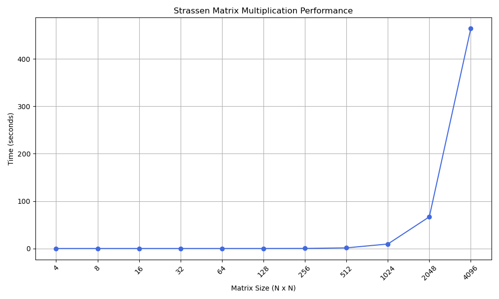

# Strassen Algorithm Implementation with Three Temporary Matrices

This project implements the Strassen matrix multiplication algorithm using only three temporary matrices. The code is organized into a library and multiple implementations, supporting square matrices of any size by padding to the next power of two when necessary.

## Project Structure

The project is organized into four main directories:
- `matrix_operation/`: Contains the shared library code for matrix operations
- `Strassen/`: Implementation of the pure Strassen algorithm
- `HybridStrassen/`: Implementation of a hybrid Strassen algorithm
- `Mmul/`: Implementation of standard matrix multiplication

## Compilation

To compile any of the implementations, navigate to the respective directory and use:

```bash
gcc -pg -O3 [implementation].c -lm ../matrix_operation/matrix.c -o [executable_name]
```

## Running the Programs

To run any implementation, execute:

```bash
./[executable_name] <matrix_size>
```

Where `<matrix_size>` is the dimension (n × n) of the square matrices to multiply. For example, to multiply two 5×5 matrices with the Strassen implementation:

```bash
cd Strassen
./strassen 5
```

For the hybrid implementation, you need to add a `<cutoff>` value:

```bash
./[executable_name] <matrix_size> <cutoff>
```

## Benchmarking

Each implementation directory contains its own benchmarking scripts to measure performance. To run a benchmark, use:

```bash
./benchmark.sh
```

The benchmarks test matrix sizes from 2^0 to 2^12. You can modify the maximum matrix size by editing the corresponding benchmark.sh script in each directory.

- The benchmark.sh for the hybrid Strassen implementation requires a `<cutoff>` argument

## Performance Analysis

Performance graphs showing execution times for various matrix sizes are generated during benchmarking:



## Finding the Optimal Cutoff Value for the Hybrid Implementation

In the HybridStrassen directory, you can determine the optimal cutoff value by running:

```bash
python FindOptimalCutoff.py
```

## Implementations

- **Strassen**: Pure Strassen algorithm with three temporary matrices
- **Hybrid Strassen**: An optimized version that combines Strassen's method with standard multiplication for smaller matrix sizes
- **Mmul**: Classic O(n³) matrix multiplication based on the definition
